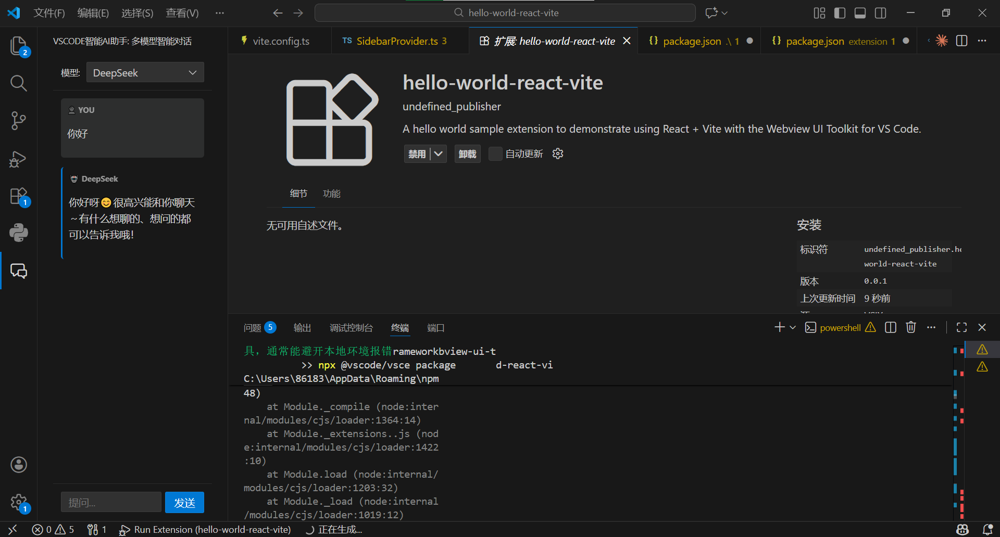

# VScode-AI-Assistant-Plugin
VScode智能助手插件 目前支持deepseek和豆包

<div align="center">
  
</div>


<div align="center">
  
</div>

## Documentation

For a deeper dive into how this sample works, read the guides below.

- [Extension structure](./docs/extension-structure.md)
- [Extension commands](./docs/extension-commands.md)
- [Extension development cycle](./docs/extension-development-cycle.md)

## Run The Sample

```bash
# Copy sample extension locally
npx degit microsoft/vscode-webview-ui-toolkit-samples/frameworks/hello-world-react-vite hello-world

# Navigate into sample directory
cd hello-world

# Install dependencies for both the extension and webview UI source code
npm run install:all

# Build webview UI source code
npm run build:webview

# Open sample in VS Code
code .
```

Once the sample is open inside VS Code you can run the extension by doing the following:

1. Press `F5` to open a new Extension Development Host window
2. Inside the host window, open the command palette (`Ctrl+Shift+P` or `Cmd+Shift+P` on Mac) and type `Hello World (React + Vite): Show`
>>>>>>> 12d684e (feat: 完成 AI 助手开发，支持多模型流式对话)
